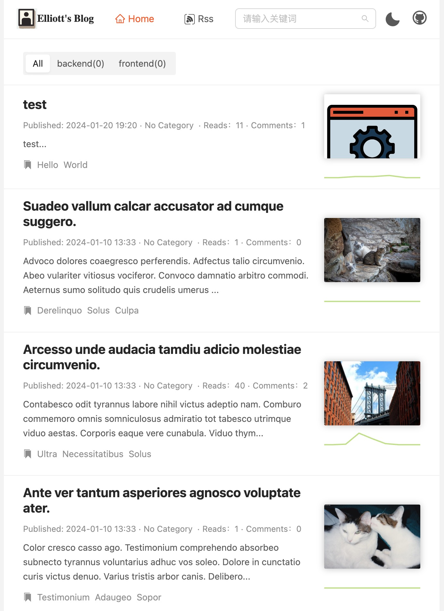
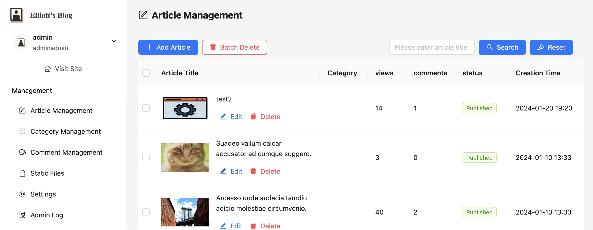

# Node Blog by Elliott

Welcome to my version of the Node Blog, inspired by [bs32g1038's Node Blog](https://github.com/bs32g1038/node-blog). This project is not just a mere clone; it's a comprehensive rework with numerous enhancements and refinements to the original.

 

## Key Enhancements

-   **Significant Rework:** While the core idea stems from the original project, I have rewritten and optimized a substantial portion of the codebase, introducing improvements in both functionality and performance.
-   **Advanced Features:** Implemented additional features to enrich the user experience and extend the capabilities of the blog.
-   **Code Optimization:** Focused on optimizing the existing code for better efficiency and readability.
-   **UI/UX Improvements:** Redesigned the user interface components for a more intuitive and user-friendly experience.

## Core Features

-   **Theme Support:** Light and dark themes for a comfortable reading experience.
-   **RESTful API:** Backend built with Node.js and Express.
-   **Responsive Design:** Seamless experience across various devices.
-   **Next.js Integration:** Leveraging Next.js for server-side rendering.
-   **Modern Frontend:** Utilizing React and Ant Design.

## Project Structure

-   `server/`: Enhanced backend logic and APIs.
-   `client/`: Reworked front-end with improved UX.
    -   `web/`: User interface for the blog.
    -   `admin/`: Administrative interface.
-   `docker-compose.yml`: Docker configuration for deployment.

## Development and Deployment

-   **Custom Development Steps:**
    -   Instructions for setting up, initializing, and running the project in a development environment.
-   **Deployment Guidelines:**
    -   Detailed steps and best practices for deploying the enhanced blog.

## Browser Compatibility

-   Ensured compatibility with modern web browsers including Chrome, Firefox, Safari, Edge, and Opera.

## Acknowledgments

Special thanks to [bs32g1038](https://github.com/bs32g1038) for the original Node Blog project, which served as a foundation for this enhanced version.

## License

This project is released under the MIT License.
